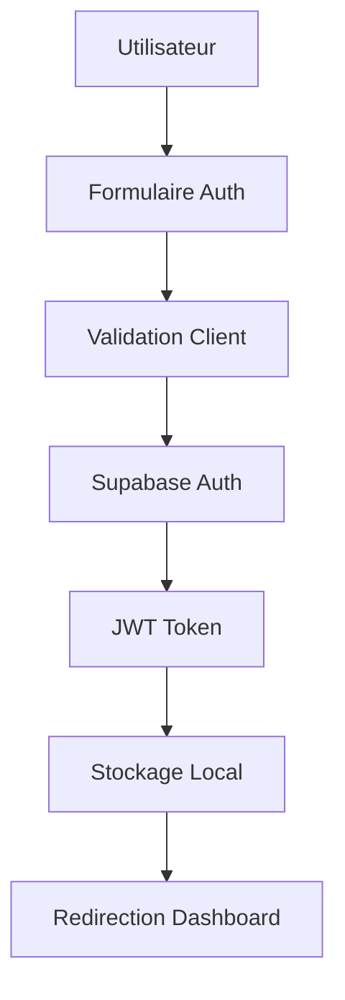

# 🔐 Authentification - Documentation Complète

## 📋 Vue d'ensemble

Le système d'authentification de WazyBot utilise Supabase Auth pour fournir une authentification sécurisée, moderne et scalable. Il supporte l'inscription par email/mot de passe avec des fonctionnalités avancées de sécurité.

## ✨ Fonctionnalités

### 🔑 Méthodes d'Authentification
- **Email/Mot de passe** - Méthode principale
- **Google OAuth** - Connexion sociale (optionnel)
- **Magic Links** - Connexion sans mot de passe (désactivé par défaut)
- **Réinitialisation de mot de passe** - Récupération sécurisée

### 🛡️ Sécurité
- **JWT Tokens** - Authentification stateless
- **Refresh Tokens** - Renouvellement automatique
- **Row Level Security (RLS)** - Protection des données
- **Rate Limiting** - Protection contre les attaques
- **Validation côté client et serveur**

## 🏗️ Architecture

### Composants Principaux

```
AuthContext (React Context)
    ↓
useAuth (Custom Hook)
    ↓
Supabase Auth Client
    ↓
PostgreSQL (auth.users)
```

### Flux d'Authentification



## 💻 Implémentation

### AuthContext Configuration

```typescript
// src/contexts/AuthContext.tsx
interface AuthContextType {
  user: User | null
  session: Session | null
  loading: boolean
  signUp: (email: string, password: string, metadata?: any) => Promise<any>
  signIn: (email: string, password: string) => Promise<any>
  signOut: () => Promise<any>
  resetPassword: (email: string) => Promise<any>
}

export function AuthProvider({ children }: { children: ReactNode }) {
  const auth = useAuth()
  return (
    <AuthContext.Provider value={auth}>
      {children}
    </AuthContext.Provider>
  )
}
```

### Hook useAuth

```typescript
// src/hooks/useAuth.ts
export function useAuth() {
  const [user, setUser] = useState<User | null>(null)
  const [session, setSession] = useState<Session | null>(null)
  const [loading, setLoading] = useState(true)

  useEffect(() => {
    // Récupérer la session initiale
    supabase.auth.getSession().then(({ data: { session } }) => {
      setSession(session)
      setUser(session?.user ?? null)
      setLoading(false)
    })

    // Écouter les changements d'auth
    const { data: { subscription } } = supabase.auth.onAuthStateChange(
      (_event, session) => {
        setSession(session)
        setUser(session?.user ?? null)
        setLoading(false)
      }
    )

    return () => subscription.unsubscribe()
  }, [])

  // Méthodes d'authentification...
}
```

### Composant de Protection

```typescript
// src/components/ProtectedRoute.tsx
const ProtectedRoute: React.FC<ProtectedRouteProps> = ({ children }) => {
  const { user, loading } = useAuthContext()

  if (loading) {
    return <LoadingSpinner />
  }

  if (!user) {
    return <Navigate to="/auth" replace />
  }

  return <>{children}</>
}
```

## 🎨 Interface Utilisateur

### Page d'Authentification

```typescript
// src/pages/AuthPage.tsx
const AuthPage: React.FC = () => {
  const [isLogin, setIsLogin] = useState(true)
  const [formData, setFormData] = useState({
    name: '',
    email: '',
    password: '',
    confirmPassword: ''
  })

  const handleSubmit = async (e: React.FormEvent) => {
    e.preventDefault()
    
    if (isLogin) {
      await signIn(formData.email, formData.password)
    } else {
      await signUp(formData.email, formData.password, {
        full_name: formData.name
      })
    }
  }

  return (
    <div className="auth-container">
      <form onSubmit={handleSubmit}>
        {/* Formulaire d'authentification */}
      </form>
    </div>
  )
}
```

### Design et UX

- **Design moderne** avec gradients et animations
- **Validation en temps réel** des champs
- **Messages d'erreur clairs** et informatifs
- **Loading states** pour les actions asynchrones
- **Responsive design** pour tous les appareils

## 🔧 Configuration

### Variables d'Environnement

```env
# Supabase Configuration
VITE_SUPABASE_URL=https://your-project.supabase.co
VITE_SUPABASE_ANON_KEY=your-anon-key

# Auth Configuration
VITE_AUTH_REDIRECT_URL=http://localhost:5173/dashboard
```

### Configuration Supabase

```sql
-- Configuration auth dans Supabase
UPDATE auth.config SET
  site_url = 'http://localhost:5173',
  enable_signup = true,
  enable_email_confirmations = false; -- Pour le développement
```

### Politiques RLS

```sql
-- Politique pour la table users
CREATE POLICY "Users can read own data" ON public.users
  FOR SELECT USING (auth.uid() = id);

CREATE POLICY "Users can update own data" ON public.users
  FOR UPDATE USING (auth.uid() = id);
```

## 📊 Gestion des Sessions

### Stockage des Tokens

```typescript
// Supabase gère automatiquement le stockage
// Les tokens sont stockés dans localStorage par défaut

// Configuration personnalisée si nécessaire
const supabase = createClient(url, key, {
  auth: {
    autoRefreshToken: true,
    persistSession: true,
    detectSessionInUrl: true,
    storage: window.localStorage // ou sessionStorage
  }
})
```

### Renouvellement Automatique

```typescript
// Le renouvellement est automatique avec Supabase
// Configuration dans supabase/config.toml
[auth]
jwt_expiry = 3600 # 1 heure
refresh_token_rotation_enabled = true
refresh_token_reuse_interval = 10
```

## 🛡️ Sécurité Avancée

### Validation des Données

```typescript
// Validation côté client
const validateEmail = (email: string): boolean => {
  const emailRegex = /^[^\s@]+@[^\s@]+\.[^\s@]+$/
  return emailRegex.test(email)
}

const validatePassword = (password: string): boolean => {
  return password.length >= 6 // Minimum 6 caractères
}

// Validation côté serveur (Supabase)
// Configurée dans les politiques RLS et triggers
```

### Protection CSRF

```typescript
// Supabase inclut une protection CSRF automatique
// Les tokens JWT incluent des claims de sécurité

// Vérification supplémentaire si nécessaire
const verifyToken = async (token: string) => {
  const { data, error } = await supabase.auth.getUser(token)
  return { data, error }
}
```

### Rate Limiting

```typescript
// Implémentation côté client
const rateLimiter = {
  attempts: 0,
  lastAttempt: 0,
  maxAttempts: 5,
  windowMs: 15 * 60 * 1000, // 15 minutes

  canAttempt(): boolean {
    const now = Date.now()
    if (now - this.lastAttempt > this.windowMs) {
      this.attempts = 0
    }
    return this.attempts < this.maxAttempts
  },

  recordAttempt(): void {
    this.attempts++
    this.lastAttempt = Date.now()
  }
}
```

## 📱 Gestion des Erreurs

### Types d'Erreurs

```typescript
interface AuthError {
  message: string
  status?: number
  code?: string
}

// Erreurs communes
const AUTH_ERRORS = {
  INVALID_CREDENTIALS: 'Email ou mot de passe incorrect',
  EMAIL_NOT_CONFIRMED: 'Veuillez confirmer votre email',
  TOO_MANY_REQUESTS: 'Trop de tentatives, réessayez plus tard',
  WEAK_PASSWORD: 'Le mot de passe doit contenir au moins 6 caractères'
}
```

### Gestion des Erreurs

```typescript
const handleAuthError = (error: AuthError): string => {
  switch (error.code) {
    case 'invalid_credentials':
      return AUTH_ERRORS.INVALID_CREDENTIALS
    case 'email_not_confirmed':
      return AUTH_ERRORS.EMAIL_NOT_CONFIRMED
    case 'too_many_requests':
      return AUTH_ERRORS.TOO_MANY_REQUESTS
    default:
      return error.message || 'Une erreur est survenue'
  }
}
```

## 🔄 Flux de Données

### Inscription

```
1. Utilisateur remplit le formulaire
2. Validation côté client
3. Appel à supabase.auth.signUp()
4. Création automatique du profil (trigger)
5. Redirection vers le dashboard
```

### Connexion

```
1. Utilisateur saisit ses identifiants
2. Validation côté client
3. Appel à supabase.auth.signInWithPassword()
4. Récupération du token JWT
5. Mise à jour du contexte auth
6. Redirection vers le dashboard
```

### Déconnexion

```
1. Utilisateur clique sur déconnexion
2. Appel à supabase.auth.signOut()
3. Suppression des tokens
4. Nettoyage du contexte
5. Redirection vers la page d'accueil
```

## 📈 Métriques et Analytics

### Métriques Suivies

```typescript
// Métriques d'authentification
interface AuthMetrics {
  signupRate: number        // Taux d'inscription
  loginSuccessRate: number  // Taux de connexion réussie
  sessionDuration: number   // Durée moyenne des sessions
  passwordResetRate: number // Taux de réinitialisation
}

// Tracking des événements
const trackAuthEvent = (event: string, properties?: any) => {
  analytics.track(event, {
    timestamp: new Date().toISOString(),
    userId: user?.id,
    ...properties
  })
}
```

### Événements Trackés

- `user_signup` - Inscription utilisateur
- `user_login` - Connexion utilisateur
- `user_logout` - Déconnexion utilisateur
- `password_reset_requested` - Demande de réinitialisation
- `email_verified` - Email vérifié

## 🧪 Tests

### Tests Unitaires

```typescript
// tests/auth.test.ts
describe('Authentication', () => {
  test('should sign up user successfully', async () => {
    const { signUp } = useAuth()
    const result = await signUp('test@example.com', 'password123')
    expect(result.error).toBeNull()
    expect(result.data.user).toBeDefined()
  })

  test('should handle invalid credentials', async () => {
    const { signIn } = useAuth()
    const result = await signIn('invalid@email.com', 'wrongpassword')
    expect(result.error).toBeDefined()
    expect(result.error.message).toContain('Invalid')
  })
})
```

### Tests d'Intégration

```typescript
// tests/auth-flow.test.ts
describe('Auth Flow', () => {
  test('complete signup flow', async () => {
    // 1. Aller sur la page d'inscription
    // 2. Remplir le formulaire
    // 3. Soumettre
    // 4. Vérifier la redirection
    // 5. Vérifier la création du profil
  })
})
```

## 🚀 Optimisations

### Performance

```typescript
// Lazy loading du contexte auth
const AuthContext = lazy(() => import('./AuthContext'))

// Memoization des valeurs du contexte
const authValue = useMemo(() => ({
  user,
  session,
  loading,
  signUp,
  signIn,
  signOut,
  resetPassword
}), [user, session, loading])
```

### Mise en Cache

```typescript
// Cache des données utilisateur
const userCache = new Map()

const getCachedUser = (userId: string) => {
  if (userCache.has(userId)) {
    return userCache.get(userId)
  }
  // Fetch from API and cache
}
```

## 📚 Ressources

### Documentation Supabase Auth
- [Auth Guide](https://supabase.com/docs/guides/auth)
- [Row Level Security](https://supabase.com/docs/guides/auth/row-level-security)
- [Auth Helpers](https://supabase.com/docs/guides/auth/auth-helpers)

### Bonnes Pratiques
- Toujours valider côté client ET serveur
- Utiliser HTTPS en production
- Implémenter le rate limiting
- Logger les tentatives de connexion suspectes
- Utiliser des mots de passe forts

---

🔐 **Sécurité First** : L'authentification est la base de la sécurité de votre application !